---

## 💖 Support This Project

If you find this project helpful and want to support what I do, you can leave a tip here — thank you!

[](https://ko-fi.com/nicxx2)

---

# 🤖 Jupiter USDC Auto Trader v10.2.2

**Self-hosted guarded Solana execution for Jupiter USDC Price Alerts.**

**Current release:** `v10.2.2` · [See what changed](CHANGELOG.md#1022---2026-08-14)

> [!IMPORTANT]
> This is the **optional execution companion** to [Jupiter USDC Price Alerts](https://github.com/Nicxx2/jupiter-usdc-price-alerts), which is the required passive monitoring and signal source. The auto trader does not monitor prices or create targets by itself. Install and run Jupiter USDC Price Alerts first; if you want alerts without automatic execution, use that project on its own.

Use the single Compose file with Docker Compose or paste it into Portainer, enter four stable secrets, deploy, then manage the trader at:

```text
http://SERVER-IP:5680
```

n8n and Hummingbot Gateway are installed, configured, published, restarted, and checked internally. Normal users do **not** import an n8n workflow or edit Gateway YAML.

> [!WARNING]
> This software can submit transactions that move real funds. Begin in **TESTING**, use a dedicated low-balance bot wallet, save its recovery key somewhere separate, and commission live trading with one deliberately tiny trade. Do not materially fund the wallet until you have verified the correct mint, wallet, signature, and balance changes end to end.

---

## 🔗 Two companion projects, two different jobs

| Project | Responsibility |
| --- | --- |
| [**Jupiter USDC Price Alerts**](https://github.com/Nicxx2/jupiter-usdc-price-alerts) | **Required passive source.** Monitoring and signal generation: token configuration, BUY/SELL targets, USDC scenario size, cooldown/reset behavior, and ntfy delivery. It works independently when alerts-only operation is preferred. |
| **Jupiter USDC Auto Trader** | **Optional execution companion.** Receives a normal price alert, reloads source configuration, obtains fresh Jupiter quotes, applies execution controls, and may submit a swap. It is not standalone. |

This is **not** a market-prediction or strategy bot. It acts only on normal BUY/SELL price alerts produced by the source application and only after independent validation.

```text
Jupiter USDC Price Alerts
        ↓ normal BUY/SELL alert
       ntfy
        ↓
Jupiter USDC Auto Trader
        ↓ guarded validation
 n8n → Hummingbot Gateway → Jupiter / Solana
```

---

## ✨ Highlights

- 🐳 **One-Compose deployment** — copy/paste into Docker Compose or Portainer.
- 🧪 **TESTING mode** — performs market/configuration validation without submitting a transaction.
- 🛑 **Separate MASTER kill switch** — `TRADING` mode and `MASTER` are deliberately independent.
- 🪙 **Exact full-mint validation** — ticker symbols and ntfy topics are never treated as token identity.
- 👛 **Per-token trading wallets** — automatic trades always use the wallet explicitly assigned to that mint.
- 🔄 **Repeated fresh Jupiter quotes** — including a final executable quote immediately before submission.
- 📉 **Price-impact and maximum-trade caps** — independent of source `usd_amount` and Gateway slippage.
- 💰 **Live balance and SOL-reserve checks** — insufficient funds abort; trade size is never silently reduced.
- 🛡️ **Replay, burst, and global-lock protection** — prevents duplicate threshold execution and overlapping real submissions.
- ⚠️ **Uncertain-transaction safety lock** — disables `MASTER` and never retries blindly.
- 🌐 **Same-server or remote source API** — select a local port or complete URL without editing the Compose.
- 🔒 **Docker-private internals** — only dashboard port 5680 is published.
- 💾 **Portable persistent storage** — Docker creates and manages the seven project-scoped volumes; no host folders need editing.

---

## 🖥️ Dashboard preview

> [!NOTE]
> These screenshots use a sanitized local demonstration with an unfunded fake wallet, demonstration token values, and mock infrastructure responses. They contain no private keys, RPC/API credentials, real transactions, or live funds.

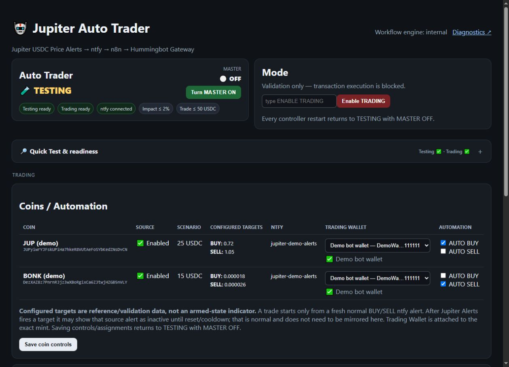

The dashboard always starts in **`TESTING` with `MASTER OFF`**. Green readiness badges mean the latest checks passed; they do not enable real trading by themselves and are recomputed before entering `TRADING`.

| Mode | MASTER | What happens |
| --- | --- | --- |
| `TESTING` | OFF | Safest setup state. Alert-driven transaction execution is blocked; the listener and diagnostics can remain active. |
| `TESTING` | ON | Intentional alerts are validated and can produce `WOULD_TRADE`, but transaction submission remains blocked. |
| `TRADING` | OFF | Trading mode is selected, but alert-driven transaction execution remains blocked. |
| `TRADING` | ON | An eligible alert may submit a transaction only after every execution check passes. |

**Recommended first run:** stay in `TESTING`/`MASTER OFF` → run **Quick Test Everything** → configure and back up a dedicated wallet → assign the exact token and AUTO direction → use a short `TESTING`/`MASTER ON` window to prove `WOULD_TRADE` → return `MASTER` off → follow the [tiny live-trade commissioning checklist](docs/commissioning.md).

<details>
<summary><strong>🧪 Understand TESTING, TRADING, and MASTER — click to expand</strong></summary>

### TESTING with MASTER ON

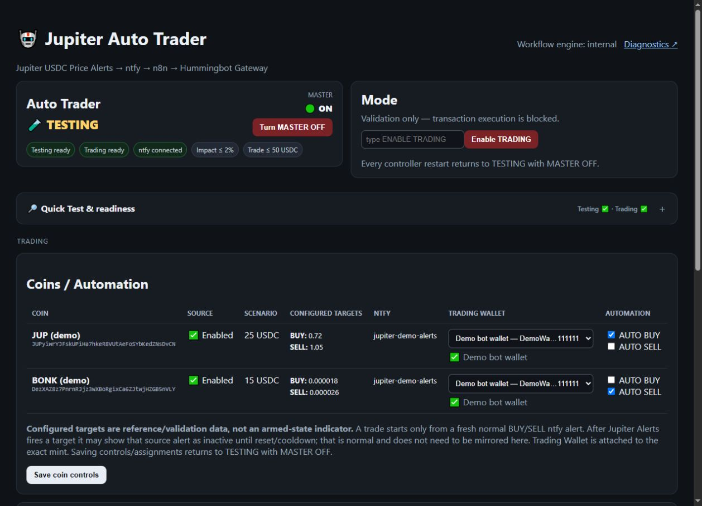

This is the intentional dry-run window. `MASTER ON` allows eligible alerts through the automated validation path, while `TESTING` still prevents blockchain submission. Confirm a `WOULD_TRADE` result contains the intended direction, exact mint, target, USDC scenario, impact, wallet, and balances.

### TRADING with MASTER OFF

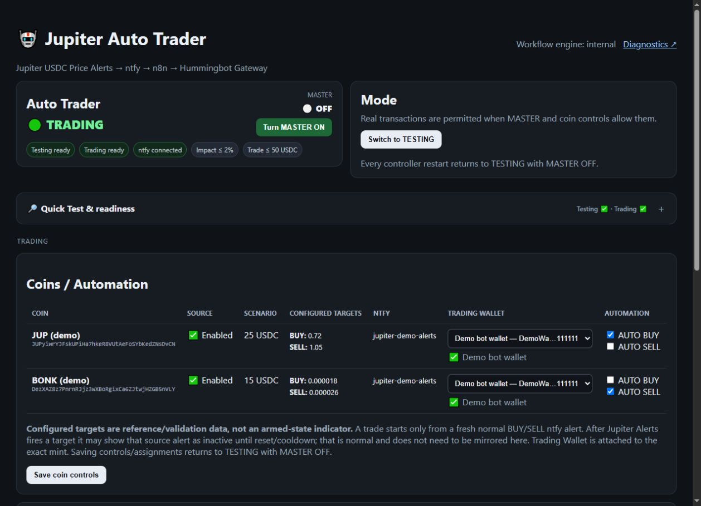

Typing `ENABLE TRADING` makes the controller recompute full Trading readiness and refuses the change if any required check is red. A successful change affects the mode only and deliberately leaves `MASTER OFF`. Real alert-driven execution is possible only after `MASTER` is enabled separately, and every safety check is still repeated before submission. Return to `TESTING`/`MASTER OFF` before changing configuration.

</details>

<details>
<summary><strong>🔎 Quick Test Everything and readiness — click to expand</strong></summary>

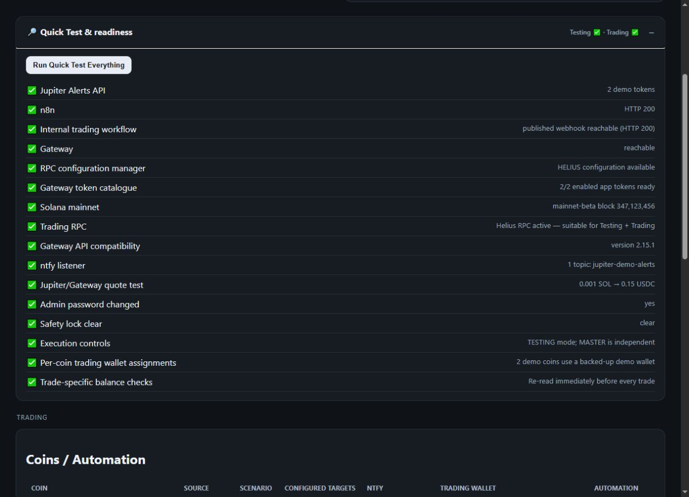

- **Infrastructure checks** verify Jupiter Alerts, n8n, the internal workflow, Gateway, Solana, ntfy, and a read-only Jupiter quote.
- **Trading checks** additionally verify the RPC choice, password, safety lock, risk caps, source directions, wallet assignments, recovery-backup confirmation, and SOL reserve.
- **Testing ready** means the validation path is available. **Trading ready** means the stricter prerequisites passed at the displayed check time; it does not change the mode or MASTER state, and entering Trading recomputes readiness.
- Run it after deployment or an update, after resolving an error, and immediately before tiny live-trade commissioning.

</details>

<details>
<summary><strong>🎯 Coins, wallets, AUTO directions, and WOULD_TRADE — click to expand</strong></summary>

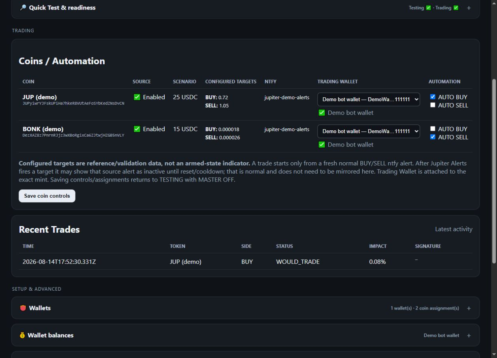

- **Source**, **Scenario**, and **Configured targets** come from the required Jupiter USDC Price Alerts app.
- **Trading wallet** is assigned to the exact full mint; automatic execution does not rely on a ticker symbol or whichever wallet is merely being viewed.
- **AUTO BUY** and **AUTO SELL** are independent. Enable only the intended direction during commissioning.
- `WOULD_TRADE` is the required TESTING result to inspect. It is not a submitted transaction and has no signature.
- Configured targets are validation references, not a mirror of whether the source currently displays an alert as armed.

</details>

<details>
<summary><strong>⚙️ Setup & advanced — section-by-section guide (click to expand)</strong></summary>

Open only the panel you need below. Perform setup and configuration changes in `TESTING` with `MASTER OFF`. Material changes automatically return the controller to that safe state.

<details>
<summary><strong>👛 Wallets — create, back up, and assign a dedicated bot wallet</strong></summary>

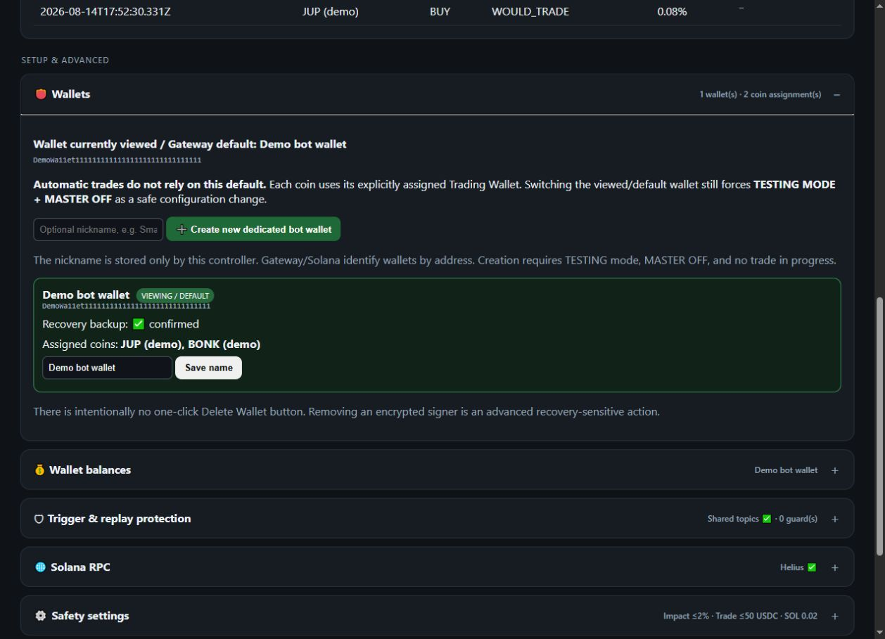

**What to do:**

1. Create a new dedicated bot wallet while in `TESTING` with `MASTER OFF`.
2. Save the one-time recovery/private key somewhere separate and secure. Never put it in GitHub, n8n, ntfy, screenshots, issues, or chat.
3. Confirm the recovery backup in the dashboard.
4. Return to **Coins / Automation**, assign that exact wallet to the intended full token mint, and enable only the intended AUTO direction.
5. Fund only the deliberately small commissioning amount plus sufficient SOL reserve.

The wallet marked **VIEWING / DEFAULT** controls this display and Gateway's default only. Automatic trades always use the wallet explicitly assigned to that coin. There is intentionally no one-click wallet deletion because removing an encrypted signer is recovery-sensitive.

</details>

<details>
<summary><strong>💰 Wallet balances — understand what is being displayed and checked</strong></summary>

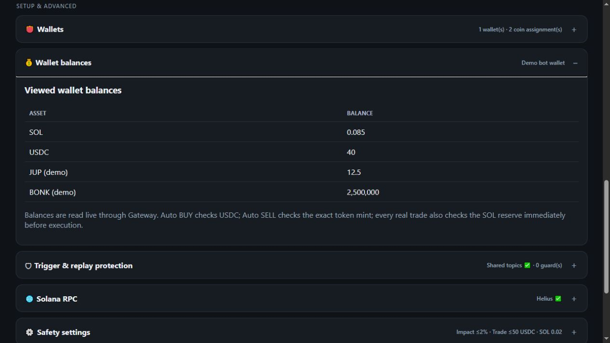

**What to do:** use this panel as a setup sanity check for the wallet currently being viewed. Confirm it has the intended small USDC/token amount and enough SOL to remain above your configured reserve.

This table does not replace execution-time checks. Immediately before every real BUY, the controller re-reads USDC and SOL on the coin's assigned wallet; before every real SELL, it re-reads the exact token mint and SOL on that assigned wallet. Insufficient funds abort—the trader never silently reduces the trade size.

</details>

<details>
<summary><strong>🛡 Trigger & replay protection — topics and duplicate-trade guards</strong></summary>

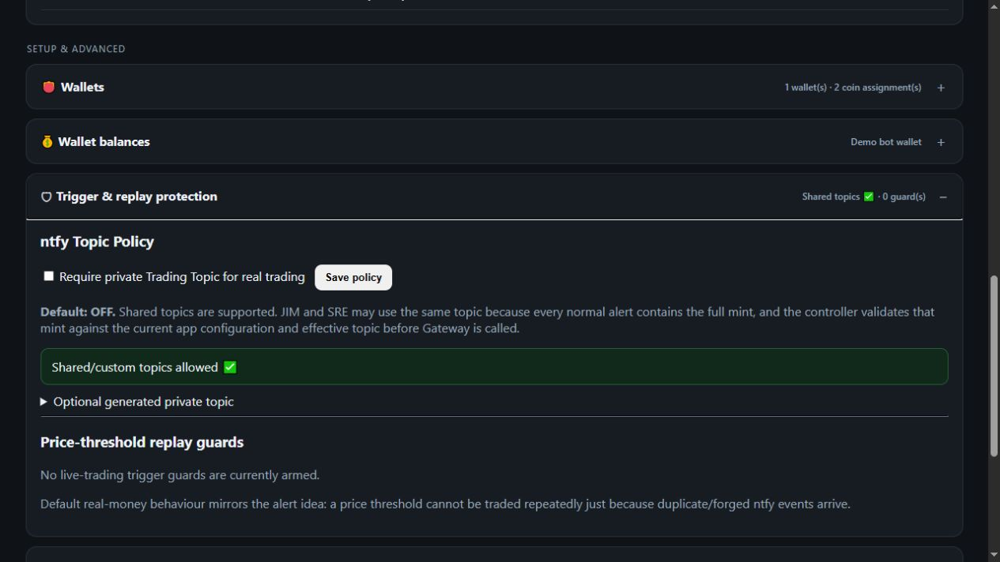

**What to do:** keep the default shared/custom-topic policy unless you intentionally want the stricter generated private Trading Topic. Shared topics remain protected by exact full-mint, current effective-topic, configured-target, and source-state validation.

To enable private-topic enforcement:

1. Expand **Optional generated private topic** and copy the generated value without publishing it.
2. In Jupiter USDC Price Alerts, make that value the effective ntfy topic for every coin whose AUTO direction is enabled here.
3. Return to this panel, enable **Require private Trading Topic for real trading**, and save the policy.
4. Confirm the panel reports that enforcement is satisfied, then rerun **Quick Test Everything**.

Treat a private topic like a secret capability. Rotating it requires updating the source application before Trading can become ready again.

After a real threshold is attempted, its replay guard prevents duplicate or replayed notifications from trading that same threshold repeatedly. Do not reset guards merely to retry a failed or uncertain transaction. Reset only after human review and after intentionally resetting or re-arming the corresponding source alert; guard reset also forces `TESTING` with `MASTER OFF`.

</details>

<details>
<summary><strong>🌐 Solana RPC — choose, test, and apply the blockchain connection</strong></summary>

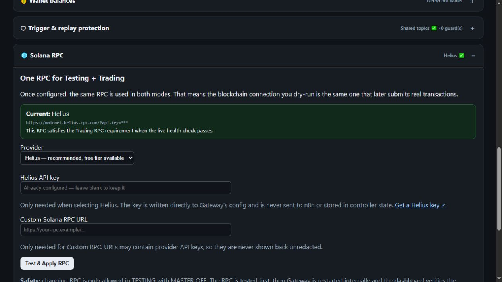

**What to do:**

1. Stay in `TESTING` with `MASTER OFF` and no trade in progress.
2. Choose **Helius** (recommended) and paste its API key, or choose **Custom RPC** and enter the complete provider URL.
3. Click **Test & Apply RPC**. The controller first preflights the endpoint, then restarts Gateway internally and verifies that the requested provider became active.
4. Confirm the green **Current** panel shows the intended provider, then rerun **Quick Test Everything**.

**Solana Public** is suitable for Testing only and deliberately cannot make Trading readiness green. If Helius is already configured, leave its key field blank to keep the existing key. Provider keys and custom URLs are never shown back unredacted; do not paste them into issues, logs, or screenshots.

</details>

<details>
<summary><strong>⚙️ Safety settings — limits to review before commissioning</strong></summary>

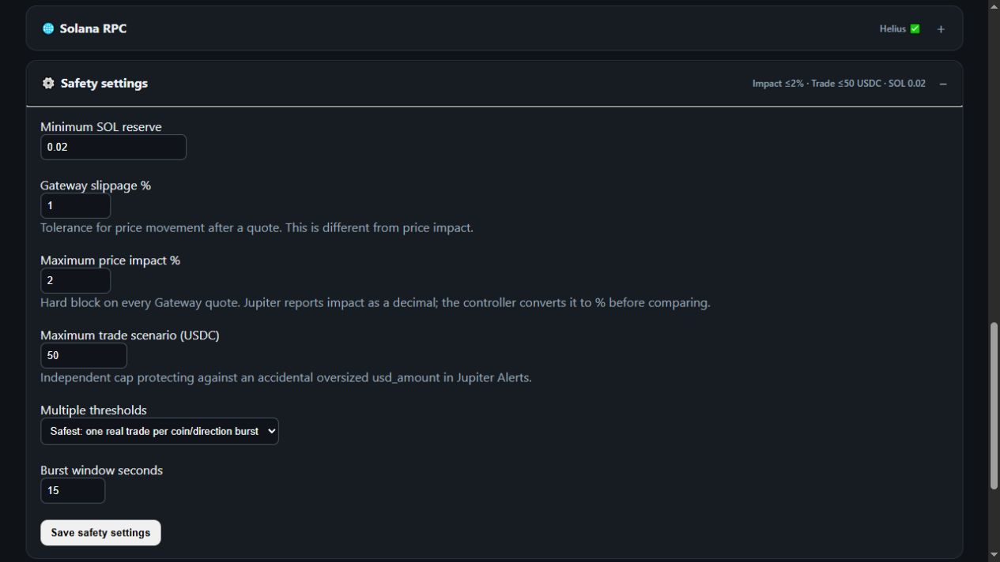

The screenshot values are demonstration examples, not universal recommendations. Review each setting for the dedicated wallet and intended token:

- **Minimum SOL reserve:** the balance that must remain available for fees and account operations.
- **Gateway slippage %:** tolerance for movement after a quote; this is separate from price impact.
- **Maximum price impact %:** a hard rejection limit applied to every Gateway quote.
- **Maximum trade scenario (USDC):** an independent ceiling on the source app's configured `usd_amount`. An intended scenario above this value is blocked; keep the ceiling only as high as necessary.
- **Multiple thresholds:** keep **Safest: one real trade per coin/direction burst** for normal use. **Trade every fired alert** can create multiple real submissions and is advanced.
- **Burst window:** collapses closely grouped alerts for the same coin and direction when the safest policy is selected.

Start conservatively with an intentionally low-balance wallet and a deliberately tiny commissioning trade. Saving changes forces `TESTING` with `MASTER OFF`.

</details>

<details>
<summary><strong>🔌 Gateway & listener — confirm the execution path is connected</strong></summary>

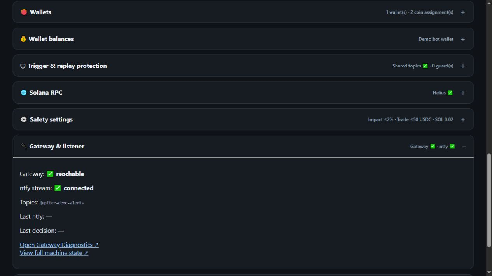

**What to look for:** Gateway should be **reachable**, the ntfy stream should be **connected**, and the listed topic should match the effective topic from Jupiter USDC Price Alerts. **Last ntfy** and **Last decision** remain blank until an alert has been processed.

If either status is unhealthy, keep `MASTER OFF`, run **Quick Test Everything**, and follow the troubleshooting guide. **Gateway Diagnostics** performs safe read-only health, status, compatibility, wallet-list, and sample-quote checks; **machine state** provides redacted diagnostic state. Do not expose Gateway or n8n ports publicly.

</details>

</details>

---

## 🚀 Quick Start

Choose the deployment method you use. Portainer is shown first because it requires only copy, paste, environment variables, and deploy.

Before deploying, install and run [Jupiter USDC Price Alerts](https://github.com/Nicxx2/jupiter-usdc-price-alerts) as the required source. Use a multi-token release exposing `GET /api/tokens`; this release was contract-checked against Jupiter Alerts v3.4. The trader host needs Linux Docker Standalone with modern Docker Compose v2, an available TCP port 5680, enough Docker storage, and outbound DNS/HTTPS access. The pinned images publish Linux AMD64 and ARM64 variants.

> [!IMPORTANT]
> Docker creates the persistent volumes automatically. Keep the Portainer stack name (or Compose project name) unchanged for the lifetime of the installation: changing it selects a different, empty volume namespace and looks like a fresh install. Never delete the stack's volumes or run `docker compose down --volumes` / `down -v` unless permanent data destruction is intended.

> [!CAUTION]
> **Updating an older private `/Configs` deployment?** Stop before deploying this Compose. Preserve the original four secrets and follow the [one-time migration procedure](docs/storage.md#one-time-migration-from-the-legacy-configs-layout). Starting first creates an empty named-volume installation; it does not import or delete the legacy data.

<details open>
<summary><strong>🧩 Portainer — copy/paste deployment</strong></summary>

### 1. Create the stack

Use a **Docker Standalone** Portainer environment.

1. Open **Stacks → Add stack → Web editor**.
2. Name it `jupiter-usdc-auto-trader`.
3. Paste the complete [`docker-compose.yml`](docker-compose.yml) into the Web editor.

Do not simplify the Compose or create separate n8n/Gateway stacks.

### 2. Add the four required environment variables

Generate four independent secrets with `openssl rand -hex 32` or another cryptographically secure generator, then add them under **Environment variables**:

```text
N8N_DB_PASSWORD=<FIRST GENERATED SECRET>
N8N_ENCRYPTION_KEY=<SECOND GENERATED SECRET>
N8N_RUNNERS_AUTH_TOKEN=<THIRD GENERATED SECRET>
GATEWAY_PASSPHRASE=<FOURTH GENERATED SECRET>
```

Keep these values stable for the lifetime of the installation. Missing or blank values stop deployment with a clear error.

### 3. Point to the required Jupiter USDC Price Alerts source

If the source app is on this same server and uses port 8000, add nothing.

For the same server on another port:

```text
APP_API_PORT=8001
```

For a different server:

```text
APP_API_URL=https://alerts.example.com/api/tokens
```

A non-empty `APP_API_URL` overrides `APP_API_PORT`.

### 4. Deploy

Click **Deploy the stack** and allow several minutes for first-time image downloads and bootstrap.

The one-shot `n8n-permissions`, `gateway-init`, and `n8n-bootstrap` containers are expected to exit successfully after completing their jobs. The other services should remain running/healthy.

Portainer automatically creates seven volumes prefixed by the stack name. No host path or storage folder needs to be entered.

Open the `trading-controller` container logs, copy the one-time **FIRST-RUN ADMIN PASSWORD**, then visit:

```text
http://SERVER-IP:5680
```

Change the generated password immediately.

➡️ [Complete Portainer walkthrough, updates, and troubleshooting](docs/portainer.md)

</details>

<details>
<summary><strong>⌨️ Docker Compose CLI — click to expand</strong></summary>

### 1. Generate the stable `.env`

```sh
umask 077
printf 'N8N_DB_PASSWORD=%s\nN8N_ENCRYPTION_KEY=%s\nN8N_RUNNERS_AUTH_TOKEN=%s\nGATEWAY_PASSPHRASE=%s\n' \
  "$(openssl rand -hex 32)" \
  "$(openssl rand -hex 32)" \
  "$(openssl rand -hex 32)" \
  "$(openssl rand -hex 32)" > .env
```

Alternatively, copy [`.env.example`](.env.example) to `.env`, fill all four blank secrets, and optionally change `APP_API_PORT` or add `APP_API_URL`.

### 2. Validate and deploy

```sh
docker compose config --quiet
docker compose up -d
docker compose ps
```

### 3. Retrieve the first-run password

```sh
docker compose logs trading-controller
```

Open `http://SERVER-IP:5680`, sign in, and change the password immediately.

</details>

> [!IMPORTANT]
> Only port **5680** is published. Do not expose it directly to the public internet. Use a trusted LAN, Tailscale, or a properly secured HTTPS reverse proxy. n8n 5678, Gateway 15888, and RPC configurator 8081 intentionally remain Docker-private.

---

## 🌐 Connecting to Jupiter USDC Price Alerts

| Layout | Environment setting | Effective endpoint |
| --- | --- | --- |
| Same server, default port | Nothing required | `http://host.docker.internal:8000/api/tokens` |
| Same server, custom port | `APP_API_PORT=8001` | `http://host.docker.internal:8001/api/tokens` |
| Another server/domain | `APP_API_URL=https://alerts.example.com/api/tokens` | The exact supplied URL |

The controller owns one canonical source endpoint. All n8n initial and final source-state checks go through the controller's Docker-private proxy, so the workflow cannot accidentally validate against a different server.

`APP_API_URL` must use HTTP(S), end in `/api/tokens`, use a valid non-zero port, and must not contain loopback hosts, embedded credentials, query parameters, fragments, or URL API keys. Prefer a private network such as Tailscale; otherwise use HTTPS and firewall the source so only the trader server can reach it. This integration does not add authentication to the Jupiter Alerts `/api/tokens` endpoint, so do not expose that endpoint publicly just to connect the two apps.

If the dashboard is served exclusively through an HTTPS reverse proxy, set `DASHBOARD_COOKIE_SECURE=true`. Do not enable it for direct `http://SERVER-IP:5680` access because browsers will then withhold the login cookie.

If Jupiter USDC Price Alerts uses a self-hosted ntfy server, set this stack's `NTFY_SERVER` to the same server using a URL reachable **from the trader container**. For ntfy on this Docker host, use `http://host.docker.internal:PORT`; do not use `localhost`, which would mean the trader container itself.

---

## 🧪 First-Time Commissioning

Every controller restart begins in **TESTING** with **MASTER OFF**.

1. Change the first-run dashboard password.
2. Run **Quick Test Everything** and resolve every failed infrastructure check.
3. Configure Helius or a suitable custom RPC. Public Solana RPC is Testing-only.
4. Create or select a dedicated low-balance bot wallet.
5. Save the recovery/private key separately and confirm the backup in the dashboard.
6. Assign that wallet to the intended exact token mint and enable only the intended AUTO direction.
7. Trigger an intentional source alert in `TESTING` and confirm `WOULD_TRADE` with the correct mint, wallet, target, amount, impact, and balances.
8. Follow the [tiny live-trade commissioning checklist](docs/commissioning.md).

Enabling `TRADING` requires deliberate typed confirmation and green Trading readiness. `MASTER` must then be enabled separately.

> [!CAUTION]
> A successful real transaction has **not yet been proven end to end on the reference deployment**. Do not describe this release as live-transaction commissioned until one deliberately tiny trade has produced a verified Solana signature and the expected wallet balance changes.

---

## 🛡️ Safety Model

| Control | Behavior |
| --- | --- |
| `TESTING` | Validates source configuration and current market quotes but cannot submit a blockchain transaction. |
| `TRADING` | Permits submission only while every execution safety check still passes. |
| `MASTER OFF` | Overrides the automation path and blocks alert-driven execution. |
| `MASTER ON` | Enables eligible AUTO directions; it never replaces Trading mode or safety validation. |

Material configuration changes return the system to `TESTING` with `MASTER OFF`.

<details>
<summary><strong>🔍 Full execution validation — click to expand</strong></summary>

An ntfy event is only a trigger to investigate. It is not sufficient authorization.

The execution path checks:

- one-time controller → n8n handoff;
- fresh normal BUY/SELL ntfy message;
- exact full Solana mint and unique source match;
- current effective topic for that exact token;
- fired target still configured;
- source token still enabled;
- source USDC scenario still unchanged and under `maxTradeUSDC`;
- matching AUTO BUY/AUTO SELL control;
- current mode, MASTER state, and safety-lock state;
- automatic Gateway token catalogue preparation by exact mint;
- repeated target-price and price-impact validation quotes;
- final source configuration and controller-state recheck;
- stable per-token wallet assignment;
- wallet exists in Gateway and recovery backup is confirmed;
- live exact-wallet USDC/token balance and minimum SOL reserve;
- exact final executable quote;
- global real-trade lock;
- duplicate/idempotency handling;
- persistent same-threshold trigger guard; and
- burst suppression.

If transaction submission becomes ambiguous, the trade becomes `UNCERTAIN`, `MASTER` is forced off, and a safety lock is engaged. No automatic retry is attempted. A restart while a transaction is `SUBMITTING` or `PENDING` produces the same fail-closed result.

</details>

<details>
<summary><strong>🧠 Source-alert behavior and non-gates</strong></summary>

The dashboard displays **Configured BUY/SELL Targets** rather than mirroring whether a source alert currently appears armed.

When Jupiter USDC Price Alerts fires a target, that source target may immediately appear inactive until its cooldown or manual reset. The fresh ntfy event remains the trigger; the target must still be configured, but it does not need to remain shown as armed.

Informational Action Readiness, Action Rules, RSI readiness, `rules_status`, and `confirmed_ready` are **not execution gates** for this project.

Shared ntfy topics are supported by default. Multiple coins may use one delivery topic because every normal alert must contain the full mint and the controller validates the topic against that exact mint. The optional stricter private Trading Topic policy can be enabled in the dashboard.

</details>

<details>
<summary><strong>📈 BUY, SELL, price impact, and slippage semantics</strong></summary>

### BUY

The configured source `usd_amount` is quoted from USDC to the token.

```text
effective BUY price = USDC input / token output
```

The effective price must remain at or below the fired BUY target.

### SELL

The workflow first derives the token quantity represented by the configured USDC scenario, then repeatedly quotes that exact token amount back to USDC.

```text
effective SELL price = USDC output / token input
```

The effective price must remain at or above the fired SELL target.

Gateway/Jupiter `priceImpactPct` is treated as a decimal fraction: `0.02` means 2%. Price impact and slippage are separate controls. Both are checked according to their own configured limits.

Insufficient funds always abort. The system never silently reduces the requested trade size.

</details>

---

## ⚙️ Configuration & Persistence

<details>
<summary><strong>🔐 Environment variables</strong></summary>

| Variable | Required | Purpose |
| --- | --- | --- |
| `N8N_DB_PASSWORD` | Yes | PostgreSQL password used by n8n. Keep stable. |
| `N8N_ENCRYPTION_KEY` | Yes | n8n credential encryption key. Changing it can make existing encrypted data unreadable. |
| `N8N_RUNNERS_AUTH_TOKEN` | Yes | Authentication between n8n and its external runner. |
| `GATEWAY_PASSPHRASE` | Yes | Protects Gateway wallet material. Keep stable and backed up. |
| `APP_API_PORT` | No | Same-server Jupiter Alerts port; defaults to `8000`. |
| `APP_API_URL` | No | Complete source endpoint; overrides `APP_API_PORT` when non-empty. |
| `DASHBOARD_COOKIE_SECURE` | No | Set `true` only when dashboard access is exclusively HTTPS; defaults to `false`. |
| `NTFY_SERVER` | No | Container-reachable ntfy base URL; must match the source app and defaults to `https://ntfy.sh`. |
| `TZ` | No | Container timezone; defaults to `Europe/London`. |

Never commit `.env`, RPC provider keys, recovery/private keys, Gateway encrypted wallet material, n8n encryption keys, database passwords, or runner tokens.

Back up all seven named volumes while the stack is stopped (or use an application-consistent backup method) and protect the four stable secrets separately. Persistence is not a substitute for a backup.

</details>

<details>
<summary><strong>💾 Docker-managed persistent volumes</strong></summary>

| Logical volume | Contents |
| --- | --- |
| `postgres_data` | n8n PostgreSQL database. |
| `n8n_data` | n8n state and configuration. |
| `bootstrap_data` | Workflow bootstrap marker and restart handshake. |
| `controller_data` | Controller login, controls, audit records, event IDs, trades, and replay guards. |
| `gateway_control` | Internal RPC token and controlled restart signaling. |
| `gateway_conf` | Gateway configuration and encrypted wallet material. |
| `gateway_logs` | Gateway logs. |

Compose/Portainer prefixes physical volume names with the project/stack name and reuses them during normal updates and container recreation. The file supplies `jupiter-usdc-auto-trader` as the stable CLI default; Portainer's stack name overrides it. A normal `docker compose down` preserves volumes; `down -v`, named-volume pruning, and explicit volume deletion do not.

➡️ [Storage, backup, restore, and legacy `/Configs` migration guide](docs/storage.md)

</details>

<details>
<summary><strong>📦 Pinned internal services</strong></summary>

- PostgreSQL 16
- n8n 2.31.6
- n8n runner 2.31.6
- Node 22 Alpine trading controller
- Hummingbot Gateway 2.15.1
- Alpine 3.22 permissions initializer

These money-moving infrastructure versions are pinned by readable release tag **and** immutable multi-architecture digest. Upgrades should be isolated, tested, and commissioned separately rather than changed casually to `latest` or to a new digest.

</details>

---

## 📚 Documentation

- 📋 [Release changelog](CHANGELOG.md)
- 🧩 [Deploying with Portainer](docs/portainer.md)
- 💾 [Storage, backup, restore, and legacy migration](docs/storage.md)
- 🏗️ [Architecture and automatic bootstrap](docs/architecture.md)
- 🧪 [Commissioning a tiny live trade](docs/commissioning.md)
- 🔎 [v10.2.2 implementation audit](docs/implementation-audit.md)
- 🛠️ [Troubleshooting](docs/troubleshooting.md)
- 🔐 [Security policy](SECURITY.md)
- 🤝 [Contributing safely](CONTRIBUTING.md)

---

## ✅ Release Verification

The repository includes automated checks for:

- Docker Compose parsing;
- required-secret rejection;
- default source port 8000;
- same-server custom source port;
- remote full source URL;
- exact project-scoped named-volume topology and `nocopy` behavior;
- Docker-private network boundaries and health/completion dependency ordering;
- the one-published-port boundary;
- embedded workflow identity and SHA-256;
- n8n BUY/SELL expression-parser regression protection;
- canonical effective-topic selection; and
- key runtime safety markers.

```sh
node scripts/verify-release.mjs
node scripts/verify-compose-matrix.mjs
```

---

## 📄 License & Risk

Licensed under the [MIT License](LICENSE).

This software is provided without warranty. It is not financial advice, and self-hosting does not remove smart-contract, token, RPC, infrastructure, key-management, or operational risk.
