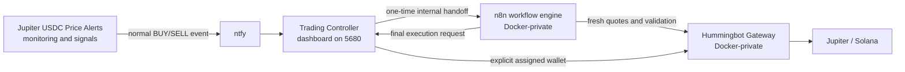

# Architecture and bootstrap

## Runtime flow



[Jupiter USDC Price Alerts](https://github.com/Nicxx2/jupiter-usdc-price-alerts) is the required passive source application and decides when a configured price target fires. The auto trader is an optional execution companion: it does not monitor or predict prices and does not use the source application's informational Action Readiness state as authorization.

## Services

| Service | Pinned image | Role | Host exposure |
| --- | --- | --- | --- |
| `postgres` | `postgres:16` | n8n database | None |
| `n8n` | `docker.n8n.io/n8nio/n8n:2.31.6` | Internal workflow engine | None |
| `n8n-runner` | `n8nio/runners:2.31.6` | External n8n task runner | None |
| `trading-controller` | `node:22-alpine` | Dashboard, source endpoint resolver/proxy, ntfy listener, durable safety state, and final execution authority | `5680` |
| `gateway-init` | `hummingbot/gateway:version-2.15.1` | Idempotent Gateway default configuration | None; no network |
| `gateway` | `hummingbot/gateway:version-2.15.1` | Jupiter quotes, balances, wallets, and execution | None |
| `rpc-configurator` | `hummingbot/gateway:version-2.15.1` | Tests and applies RPC configuration, then signals a controlled Gateway restart | None |
| `n8n-permissions` | `alpine:3.22` | Repairs ownership/mode on persistent n8n/bootstrap paths | None; no network |
| `n8n-bootstrap` | `docker.n8n.io/n8nio/n8n:2.31.6` | Installs, publishes, verifies, and activates the embedded workflow | None |

Three isolated bridge networks limit normal service reachability:

- `n8n_db`: PostgreSQL, n8n, and bootstrap.
- `n8n_runners`: n8n and runner.
- `trading_control`: n8n, bootstrap, controller, Gateway, and RPC configurator.

## One-Compose bootstrap

1. `n8n-permissions` prepares the mounted `n8n_data` and `bootstrap_data` named-volume paths and applies UID/GID 1000 ownership with user read/write/execute access.
2. PostgreSQL becomes healthy.
3. n8n starts under a small supervisor. A hidden bootstrap owner is provisioned only for a genuinely fresh n8n data directory.
4. `n8n-bootstrap` checks the workflow marker and published workflow.
5. If needed, it decodes the embedded JSON, unpublishes only workflows matching the Jupiter Auto Trader name/webhook identity, imports the fixed workflow ID, publishes it, and verifies it.
6. The bootstrap writes a restart request. The n8n supervisor restarts the actual n8n child, acknowledges the requested workflow hash, and returns healthy.
7. The runner and controller start only after bootstrap completion and required health checks.

The v10.2.2 workflow identity is `JATCommunity1022` and its generated SHA-256 is `d9cdd129533546d7c0ab4178eb9cb8a4dd517f55da5be43be930b43c5a677848`. Bootstrap deterministically prepares the embedded audited template with the v10.2.2 identity, first-release note, and controller source-proxy URLs, verifies that exact hash, and only then imports it. `scripts/verify-release.mjs` performs the same deterministic verification before release.

## Source API configuration

The controller resolves one canonical Jupiter Alerts endpoint at startup:

1. A non-empty `APP_API_URL` is used as the complete endpoint.
2. Otherwise, `APP_API_PORT` builds `http://host.docker.internal:PORT/api/tokens`.
3. The port defaults to 8000.

Malformed or unsafe values fail at controller startup with a clear log message. A valid but unreachable endpoint leaves readiness red and prevents trading.

n8n never embeds or independently resolves the external source URL. Its initial and final app-state nodes call `http://trading-controller:8080/internal/source-state`, which performs a fresh fetch using the controller's resolved endpoint. This prevents controller/workflow configuration drift while keeping the source URL out of the workflow definition.

## Gateway restart supervision

Gateway is started as the actual server process:

```text
START_SERVER=true node dist/index.js --dev
```

The explicit `--dev` selects HTTP because Gateway is reachable only through the private `trading_control` Docker network; port 15888 is never published to the host. It does not affect Testing versus Trading mode, which is enforced separately by the controller. The supervisor tracks that Node PID. An RPC change is preflighted by the internal configurator, written directly to persistent Gateway YAML, and followed by a signal that terminates the actual server. The supervisor waits, force-stops after its timeout if necessary, starts a fresh process, and the controller verifies the requested provider from live Gateway status.

The configurator authentication token is generated inside the private `gateway_control` volume, mounted only into the controller/configurator path, and not supplied by the user.

## Execution authority

ntfy delivery alone is never sufficient authorization. The controller creates a short-lived random handoff value before calling the internal n8n webhook. n8n must claim it before any final execution request can be accepted.

n8n performs parsing, source/configuration checks, and repeated quotes. The controller remains the final authority: it reloads source state, rechecks the exact mint/topic/target/scenario, verifies current controls and wallet assignment, checks the final quote, reads live balances, acquires the global lock, persists `SUBMITTING`, arms the threshold guard, and only then calls Gateway with the explicitly assigned wallet.

If submission cannot be resolved conclusively, the trade becomes `UNCERTAIN`; `MASTER` is disabled and the safety lock remains until a human reviews and explicitly clears it. A controller restart converts persisted `SUBMITTING` or `PENDING` records to `UNCERTAIN` rather than retrying.

## Persistent trust boundary

The runtime uses seven Docker-managed, project-scoped named volumes rather than host-specific binds or anonymous volumes. Each mount uses `volume.nocopy: true`, so initialization happens explicitly and an image cannot seed a supposedly fresh volume through Docker's normal copy-up behavior.

| Trust/state boundary | Volume |
| --- | --- |
| PostgreSQL | `postgres_data` |
| n8n application data | `n8n_data` |
| workflow bootstrap/restart handshake | `bootstrap_data` |
| controller safety, login, audit, trade, and replay state | `controller_data` |
| controller/configurator RPC control | `gateway_control` |
| Gateway configuration and encrypted signer material | `gateway_conf` |
| Gateway logs | `gateway_logs` |

Compose service names are used only for Docker-private discovery; there are no fixed host-global container names. The project/stack name scopes networks and physical volume names. Changing that name selects a different storage namespace, so operators must keep it stable.

All seven volumes and the stable four environment secrets are required for a faithful restore. They should never be copied into this repository. See [Storage, backup, and restore](storage.md).
