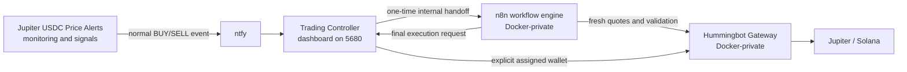

# Architecture and bootstrap

## Runtime flow



[Jupiter USDC Price Alerts](https://github.com/Nicxx2/jupiter-usdc-price-alerts) is the required passive source application and decides when a configured price target fires. The auto trader is an optional execution companion: it does not monitor or predict prices and does not use the source application's informational Action Readiness state as authorization.

## Services

| Service | Pinned image | Role | Host exposure |
| --- | --- | --- | --- |
| `postgres` | `postgres:16` | n8n database | None |
| `n8n` | `docker.n8n.io/n8nio/n8n:2.31.6` | Internal workflow engine | None |
| `n8n-runner` | `n8nio/runners:2.31.6` | External n8n task runner | None |
| `trading-controller` | `node:22-alpine` | Dashboard, source endpoint resolver/proxy, ntfy listener, durable safety state, and final execution authority | `5680` |
| `gateway-init` | `hummingbot/gateway:version-2.15.1` | Idempotent Gateway default configuration | None; no network |
| `gateway` | `hummingbot/gateway:version-2.15.1` | Jupiter quotes, balances, wallets, and execution | None |
| `rpc-configurator` | `hummingbot/gateway:version-2.15.1` | Tests and applies RPC configuration, then signals a controlled Gateway restart | None |
| `n8n-permissions` | `alpine:3.22` | Repairs ownership/mode on persistent n8n/bootstrap paths | None; no network |
| `n8n-bootstrap` | `docker.n8n.io/n8nio/n8n:2.31.6` | Installs, publishes, verifies, and activates the embedded workflow | None |

Three isolated bridge networks limit normal service reachability:

- `n8n_db`: PostgreSQL, n8n, and bootstrap.
- `n8n_runners`: n8n and runner.
- `trading_control`: n8n, bootstrap, controller, Gateway, and RPC configurator.

## One-Compose bootstrap

1. `n8n-permissions` prepares the mounted `n8n_data` and `bootstrap_data` named-volume paths and applies UID/GID 1000 ownership with user read/write/execute access.
2. PostgreSQL becomes healthy.
3. n8n starts under a small supervisor. A hidden bootstrap owner is provisioned only for a genuinely fresh n8n data directory.
4. `n8n-bootstrap` checks the workflow marker and published workflow.
5. If needed, it decodes the embedded JSON, unpublishes only workflows matching the Jupiter Auto Trader name/webhook identity, imports the fixed workflow ID, publishes it, and verifies it.
6. The bootstrap writes a restart request. The n8n supervisor restarts the actual n8n child, acknowledges the requested workflow hash, and returns healthy.
7. The runner and controller start only after bootstrap completion and required health checks.

The controller source is kept inside the same Compose document and mounted read-only at `/run/jat/trading-controller.js` through an inline Compose config. Node receives only that short file path at startup. This avoids Linux's per-argument size limit as the controller grows, without adding a host path, a separately downloaded file, or another persistent-data location. It requires Docker Compose v2.23.1 or newer and does not use a Docker Swarm config.

The workflow identity remains `JATCommunity1022` and its generated SHA-256 is `d9cdd129533546d7c0ab4178eb9cb8a4dd517f55da5be43be930b43c5a677848`. Bootstrap deterministically prepares the embedded audited v10.2.2 workflow template, first-release note, and controller source-proxy URLs, verifies that exact hash, and only then imports it. The v10.2.3 patch hardens the controller, RPC preflight, and Compose lifecycle; v10.2.4 adds responsive controller-rendered presentation; v10.2.5 aligns related content inside mobile cards; v10.2.6 adds bounded controller-side alert outcome visibility; and v10.2.7 changes only how the unchanged controller source is delivered at container startup. None changes those 52 workflow nodes or their execution behavior. `scripts/verify-release.mjs` performs the same deterministic verification before release.

## Source API configuration

The controller resolves one canonical Jupiter Alerts endpoint at startup:

1. A non-empty `APP_API_URL` is used as the complete endpoint.
2. Otherwise, `APP_API_PORT` builds `http://host.docker.internal:PORT/api/tokens`.
3. The port defaults to 8000.

Malformed or unsafe values fail at controller startup with a clear log message. A valid but unreachable endpoint leaves readiness red and prevents trading.

The ntfy base URL is resolved once with the same container-aware loopback protection. It must be unauthenticated HTTP(S), may include a path prefix, and cannot contain embedded credentials, a query, or a fragment. The listener bounds incomplete stream lines and accepts only bounded string event IDs before anything can enter durable replay state. It intentionally does not invent a different server or authentication scheme from the source application.

n8n never embeds or independently resolves the external source URL. Its initial and final app-state nodes call `http://trading-controller:8080/internal/source-state`, which performs a fresh fetch using the controller's resolved endpoint. This prevents controller/workflow configuration drift while keeping the source URL out of the workflow definition.

## Gateway restart supervision

Gateway is started as the actual server process:

```text
START_SERVER=true node dist/index.js --dev
```

The explicit `--dev` selects HTTP because Gateway is reachable only through the private `trading_control` Docker network; port 15888 is never published to the host. It does not affect Testing versus Trading mode, which is enforced separately by the controller. The supervisor tracks that Node PID. An RPC change is preflighted by the internal configurator, written directly to persistent Gateway YAML, and followed by a unique restart request that terminates the actual server. The supervisor waits, force-stops after its timeout if necessary, starts a fresh process, and acknowledges that request. The controller accepts success only when the matching acknowledgement and a fingerprint of Gateway's live RPC URL both match; the raw URL/key is not put in the acknowledgement.

The configurator authentication token is generated inside the private `gateway_control` volume, mounted only into the controller/configurator path, and not supplied by the user.

## Execution authority

ntfy delivery alone is never sufficient authorization. The controller creates a short-lived random handoff value before calling the internal n8n webhook. n8n must claim it before any final execution request can be accepted.

n8n performs parsing, source/configuration checks, and repeated quotes. The controller remains the final authority: it reloads source state, rechecks the exact mint/topic/target/scenario, verifies current controls and wallet assignment, checks the final quote, and reads live balances. After those asynchronous calls it repeats the durable alert ID, source, mode, `MASTER`, safety lock, AUTO direction, exact assignment, recovery confirmation, caps, balances, and threshold guard checks synchronously; it then acquires the global lock, persists `SUBMITTING`, arms the threshold guard, and only then calls Gateway with the explicitly assigned wallet. The post-async duplicate check makes a concurrent replay idempotent even if both requests began before the first trade record existed.

The controller-to-n8n webhook wait is longer than the controller's bounded transaction execution and signature-polling path, so ntfy replay is not triggered merely because a legitimate pending transaction needed more than two minutes to resolve.

If submission cannot be resolved conclusively, the trade becomes `UNCERTAIN`; the safety lock is persisted before that trade status, `MASTER` is disabled, and the lock remains until a human reviews and explicitly clears it. A controller restart converts persisted `SUBMITTING` or `PENDING` records to `UNCERTAIN`, reconstructs a missing cross-file guard if needed, and re-engages the lock for any persisted uncertainty rather than retrying. Clearing after investigation records `REVIEWED` while leaving the threshold guard for a separate deliberate reset.

RPC application is also fail-closed: the configurator checks the endpoint's exact Solana mainnet-beta genesis hash and a fresh confirmed blockhash before atomically replacing each Gateway YAML file and requesting a supervised restart. Concurrent changes are serialized, and Trading readiness remains red until the change finishes. A reachable devnet or testnet RPC is therefore not sufficient.

## Alert activity and trade history

The controller already persists a bounded audit log in `controller_data`. For each bounded ntfy event ID, v10.2.6 records a received state, any pre-terminal handoff error, and the terminal n8n decision using sanitized structured fields. Mode, MASTER, and the relevant exact-mint AUTO direction are snapshotted at receipt, so an uncertain result that subsequently forces MASTER off does not rewrite the historical context. Available wallet, recovery, balance, reserve, cap, quote, and signature details are allowlisted by field and type rather than retaining the workflow response. A safe reconnect/replay updates the same conceptual dashboard entry; sparse legacy results cannot erase richer details, an unknown generic row cannot downgrade a specific terminal result, and a later duplicate receive event cannot replace it with a misleading processing state. Whenever a durable trade record exists for the event, its status is authoritative over a contradictory response. A claimed live-trade outcome without a matching durable controller record is rejected. A malformed successful n8n response uses an existing durable record when one exists; otherwise it becomes a local terminal `ABORTED` result and is marked seen so later control changes cannot cause the old alert to execute. An unexpectedly unresolved recovered record becomes `UNCERTAIN` only after its safety lock and MASTER-off state are persisted. Network and non-success HTTP failures retain the pre-terminal safe-retry path. A receive-only entry older than ten minutes is presented as an interrupted-handoff warning without mutating its audit row, replay state, or execution behavior. This changes neither the durable audit schema requirement (`at` and `kind`) nor the duplicate-event execution authority.

The collapsed **Recent Alert Activity** heading is derived from the newest merged entry. Its expanded view shows three results initially and up to ten in total, with each result independently expandable. It includes `WOULD_TRADE`, ignored non-price notifications, blocked/aborted validation, suppressions, handoff errors, and live outcomes. Raw notification payloads and topic names are not rendered there; free text is bounded and HTML-escaped, numeric fields must already be finite JSON numbers, and Explorer links are constructed only from Base58-shaped signatures.

**Recent Trades** remains the durable execution-record view rather than a second alert log. It renders the newest three records and can reveal records four through ten. The underlying bounded trade collection still retains up to 500 records for restart recovery and safety evidence, with its latest 20 exposed through authenticated machine diagnostics; no trade is deleted merely because it is outside the compact dashboard view.

## Persistent trust boundary

The runtime uses seven Docker-managed, project-scoped named volumes rather than host-specific binds or anonymous volumes. Each mount uses `volume.nocopy: true`, so initialization happens explicitly and an image cannot seed a supposedly fresh volume through Docker's normal copy-up behavior.

| Trust/state boundary | Volume |
| --- | --- |
| PostgreSQL | `postgres_data` |
| n8n application data | `n8n_data` |
| workflow bootstrap/restart handshake | `bootstrap_data` |
| controller safety, login, audit, trade, and replay state | `controller_data` |
| controller/configurator RPC control | `gateway_control` |
| Gateway configuration and encrypted signer material | `gateway_conf` |
| Gateway logs | `gateway_logs` |

Compose service names are used only for Docker-private discovery; there are no fixed host-global container names. The project/stack name scopes networks and physical volume names. Changing that name selects a different storage namespace, so operators must keep it stable.

All seven volumes and the stable four environment secrets are required for a faithful restore. They should never be copied into this repository. See [Storage, backup, and restore](storage.md).

Docker stdout/stderr for every service uses the rotating `local` driver (10 MB × 3 files). PostgreSQL receives a 60-second stop grace period, while n8n, its runner, and Gateway receive 30 seconds so their explicit supervisors can finish their own shutdown windows before Docker forces termination. The persistent `gateway_logs` volume remains a separate capacity concern.
